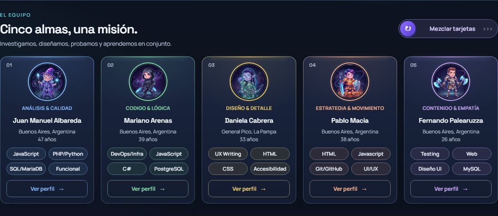
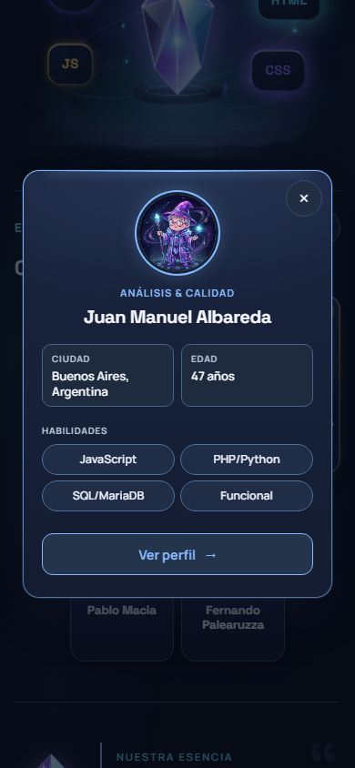
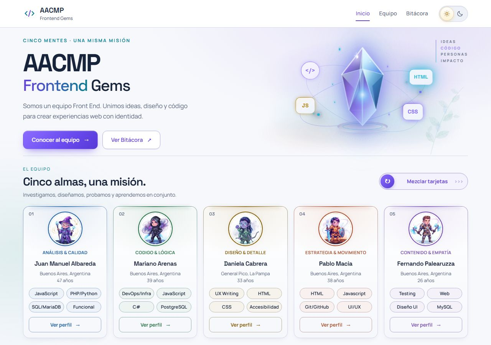
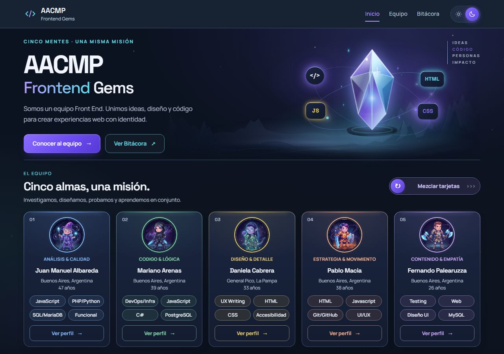
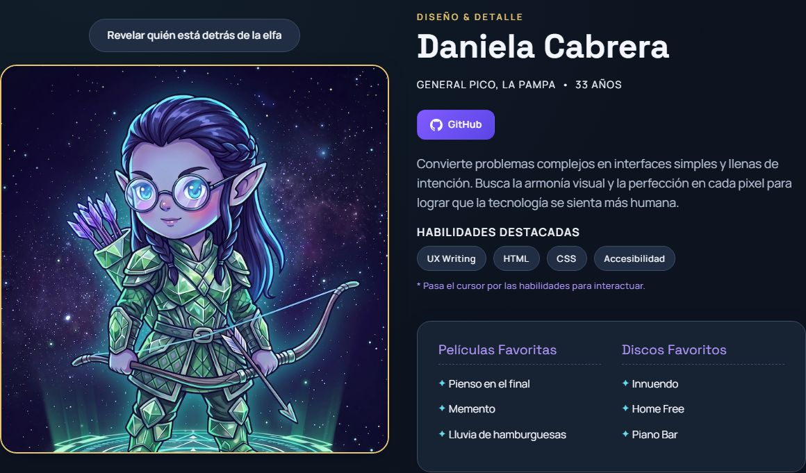
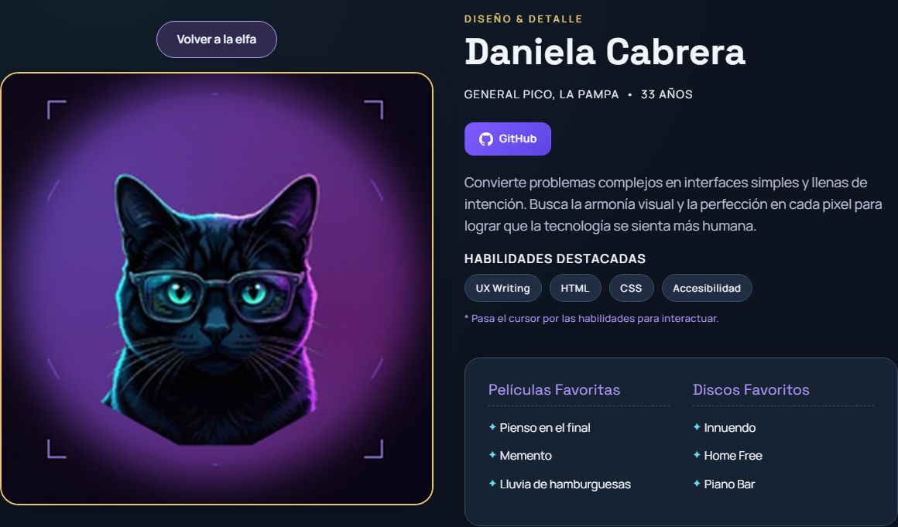

# AACMP — Frontend Gems

Primer Trabajo Práctico Grupal para la materia **Desarrollo de Sistemas Web Front End (2026)**. El sitio presenta al equipo de trabajo a través de una identidad de fantasía —una gema con una faceta por integrante y un personaje ilustrado para cada uno—, reúne perfiles individuales interactivos y documenta el proceso de desarrollo en una bitácora navegable.

**Cinco almas, una misión**: distintas miradas que aportan, cada una desde lo suyo, a una misma construcción.

---

## Integrantes

| Integrante | Rol / Enfoque | Perfil | GitHub |
| --- | --- | --- | --- |
| **Pablo Macia** | Estrategia & Movimiento | [Ver perfil](pablo.html) | [@pablormacia](https://github.com/pablormacia) |
| **Juan Manuel Albareda** | Análisis & Calidad | [Ver perfil](juan.html) | [@juanmanuelalbareda](https://github.com/juanmanuelalbareda) |
| **Daniela Cabrera** | Diseño & Detalle | [Ver perfil](daniela.html) | [@Dancay5071](https://github.com/Dancay5071) |
| **Mariano Arenas** | Código & Lógica | [Ver perfil](mariano.html) | [@NanoCode10](https://github.com/NanoCode10) |
| **Fernando Palearuzza** | Contenido & Empatía | [Ver perfil](fernando.html) | [@FerPalearuzza](https://github.com/FerPalearuzza) |

---

## Demo

- **Sitio publicado en Vercel:** [https://tp1-dswf-aacmp.vercel.app](https://tp1-dswf-aacmp.vercel.app)

---

## Tecnologías

- **HTML5 Semántico:** marcado estructurado con accesibilidad integrada (atributos ARIA, marcas navegables y landmarks).
- **CSS3 Avanzado:** variables CSS (Custom Properties), CSS Grid, Flexbox, animaciones `@keyframes`, efectos de cristal/papel (`backdrop-filter`) y filtros SVG de textura noise (`fractalNoise`).
- **JavaScript Nativo (Vanilla JS):** manipulación directa del DOM, eventos, `IntersectionObserver` para animaciones al hacer scroll, ScrollSpy de navegación y **Web Audio API** para el sonido de los perfiles.
- **Tipografías (Google Fonts):** *Space Grotesk* y *Manrope*.
- **Control de Versiones & Despliegue:** Git, GitHub para trabajo colaborativo y Vercel para hosting continuo.

---

## Estructura del Proyecto

```text
TP1-DSWF-AACMP/
├── index.html            # Portada: presentación del equipo y grilla de tarjetas
├── juan.html             # Perfil individual de Juan Manuel
├── mariano.html          # Perfil individual de Mariano
├── daniela.html          # Perfil individual de Daniela
├── pablo.html            # Perfil individual de Pablo
├── fernando.html         # Perfil individual de Fernando
├── pages/
│   └── bitacora.html     # Bitácora y registro del proceso
├── css/
│   ├── styles.css        # Base: variables, tipografía y sistema visual inicial
│   ├── guild.css         # Identidad actual: gema, tarjetas, modo oscuro, responsive
│   ├── refinement.css    # Ajustes finos de la portada
│   └── hechizo.css       # Botón y animación del revelado en los perfiles
├── js/
│   ├── theme.js          # Modo claro/oscuro, recordando la preferencia
│   ├── main.js           # Menú y animaciones en todo el sitio; mezclador, tarjetas y ScrollSpy en la portada
│   └── hechizo.js        # Revelado del avatar y sonido con Web Audio API
├── img/
│   ├── <nombre>{300,720,1500}.webp      # Avatar de cada integrante en tres tamaños
│   ├── <nombre>Dark{300,720,1500}.webp  # Su variante para el tema oscuro
│   ├── <nombre>-real.jpg                # Imagen que revela el hechizo
│   ├── gema-<nombre>.svg                # Faceta de cada integrante (respaldo del hechizo)
│   ├── fondo-*.svg                      # Fondos de hojas, estrellas y montañas
│   ├── favicon.svg                      # La gema del equipo como ícono
│   └── apple-touch-icon.png             # Ícono para pantalla de inicio en iOS
├── docs/
│   └── capturas/         # Capturas de las funciones JavaScript, para este README
└── README.md
```

`styles.css` y `guild.css` se cargan en todas las páginas; `refinement.css` sólo en la portada y `hechizo.css` sólo en los perfiles.

---

## Guía de Estilos (Sistema de Diseño)

El sistema visual combina la gema del equipo, los personajes ilustrados y fondos de hojas, estrellas y montañas, sobre una paleta de dos temas, claro y oscuro.

### Paleta de Colores

| Variable | Claro | Oscuro | Uso |
| --- | --- | --- | --- |
| `--bg` | `#f7f8fc` | `#0d1420` | Fondo general |
| `--surface` | `#ffffff` | `#172233` | Tarjetas y paneles |
| `--surface-soft` | `#eef1f8` | `#202d43` | Fondos suaves y etiquetas |
| `--text` | `#17233b` | `#f3f6fc` | Texto principal |
| `--text-muted` | `#526078` | `#b5c1d3` | Texto secundario |
| `--accent` | `#6542d9` | `#b49aff` | Acento: botones, enlaces y detalles |
| `--tech` | `#087c91` | `#63dcec` | Acento frío para detalles técnicos |
| `--border` | `#d4dbea` | `#3c4d66` | Bordes |

Los nombres de la paleta original (`--paper`, `--ink`, `--sage`…) se conservan apuntando a estas variables, para que el CSS escrito sobre el sistema anterior siga funcionando.

### Un color por integrante

Tiñe el rol, el borde de su tarjeta, el anillo de su foto y su enlace «Ver perfil»:

| Integrante | Claro | Oscuro |
| --- | --- | --- |
| Juan Manuel | `#2463a6` | `#85baff` |
| Mariano | `#28734a` | `#82d5a8` |
| Daniela | `#886312` | `#e7c66d` |
| Pablo | `#ab5232` | `#f1ab8e` |
| Fernando | `#7750b2` | `#c6a3f4` |

La gema de la portada tiene sus propios gradientes SVG —`facetCoral`, `facetBlue`, `facetGold`, `facetGreen` y `facetLavender`—, en los mismos matices pero en versión pastel.

### Tipografía

- **Space Grotesk** (`--font-display`, `--font-heading`): títulos.
- **Manrope** (`--font-body`, `--font-label`): párrafos, etiquetas y botones.

### Iconografía

SVG escritos directamente en el HTML: la gema de la portada, el sol y la luna del botón de tema, la flecha de volver arriba. Los fondos (`fondo-hojas.svg`, `fondo-estrellas.svg`, `fondo-montanas.svg`) y el favicon van como archivos. Sin librerías de iconos.

---

## Funciones JavaScript

### En la portada — `js/main.js`

**1. Mezclador de tarjetas.** Reordena al azar los cinco perfiles, los renumera del 01 al 05 y dispara una animación en la grilla. El control no es un botón común: el ícono se **arrastra** con Pointer Events, así que responde igual a mouse, dedo o lápiz, y sólo mezcla si se lo lleva hasta el final. Como además es un `<button>`, funciona con clic, Enter y Espacio. Al terminar anuncia el nuevo orden en voz alta para lectores de pantalla.



**2. Tarjetas con giro.** En pantallas angostas o táctiles, tocar una tarjeta la da vuelta y muestra los datos del integrante; en escritorio la tarjeta entera es un enlace al perfil. Sólo hay una girada a la vez, se cierra con **Escape**, y la cara que no se ve queda marcada como `inert` para que el teclado y el lector de pantalla la salteen.



**3. ScrollSpy de navegación.** Marca en el menú la sección en la que está el visitante y lo comunica con `aria-current`, no sólo con el color.

**4. Menú móvil.** Abre y cierra la navegación, mantiene `aria-expanded` al día y se cierra solo al elegir un destino.

**5. Animaciones al entrar en pantalla.** Con `IntersectionObserver`, cada bloque aparece al llegar a la vista y las tarjetas se iluminan al pasar por el centro. La gema se **pausa** cuando sale de pantalla o la pestaña queda en segundo plano, y todo el movimiento se desactiva si el visitante pidió reducirlo en su sistema.

### En todo el sitio — `js/theme.js`

**Modo claro y oscuro.** Arranca respetando la preferencia del sistema operativo y recuerda la elección en `localStorage`. El script se ejecuta en el `<head>`, antes de pintar la página, para que no haya un destello blanco al entrar en modo oscuro.

| Claro | Oscuro |
| --- | --- |
|  |  |

### En cada perfil — `js/hechizo.js`

**El hechizo.** El avatar de cada integrante es un personaje ilustrado. Al tocar el botón suena un arpegio, la imagen destella y se transforma en la imagen que esa persona eligió mostrar; otro toque vuelve al personaje.

El sonido **no es un archivo**: se sintetiza en el momento con la **Web Audio API**, con cuatro osciladores encadenados y su envolvente de volumen. Cada perfil declara su propio acorde en el HTML, así que **el hechizo de cada integrante suena distinto**. Se dispara con un clic y no con el cursor, para que funcione igual en celular, y respeta `prefers-reduced-motion`.

| Antes | Después |
| --- | --- |
|  |  |

---

## Optimización del sitio

Los avatares que originalmente eran pesados archivos jpg se convirtieron a un formato más liviano (WebP) y se generaron en varios tamaños para evitar descargar imágenes más pesadas de lo necesario:

- En la portada se usa sólo la variante de **300 px**, que alcanza para el tamaño de las tarjetas.
- En los perfiles se usan **720 px** y **1500 px** con `srcset` y `sizes`, para que el navegador elija según la pantalla.

También se mantienen versiones claras y oscuras de cada avatar, que se intercambian al cambiar el tema.

En la portada las imágenes cargan diferidas (`loading="lazy"`). En el perfil el avatar carga con prioridad (`fetchpriority="high"`), porque es lo primero que se ve.

## Uso de Inteligencia Artificial y Autoría

Se emplearon herramientas de **Inteligencia Artificial** —ChatGPT (GPT-5.5), Claude (Opus 5, Sonnet, Haiku), Gemini (3.1 Pro y 3.5 Flash-Lite), en sus versiones gratuitas y con plan pago según el caso— como apoyo técnico y creativo para:

- Interpretación inicial de consignas y estructuración del layout HTML.
- Sugerencia de fórmulas matemáticas para lavados de acuarela en CSS y animaciones `@keyframes`.
- Generación de textos base y borradores para la bitácora.
- Generación de los avatares y de la gema, con prompts que pedían un personaje de fantasía por integrante, en versión clara y oscura, con un estilo común para todo el equipo.
- Programación del sonido del hechizo: de la idea de «un ruidito de magia al tocar el botón» salió sintetizarlo con la Web Audio API, en lugar de usar un archivo de audio de terceros.
- Sugerencias de optimización en base a informes de Lighthouse y varias propuestas de código.

El equipo ya venía trabajando con estas herramientas antes de la cursada, con distinto grado de experiencia.

Todo el código generado fue revisado, probado, estilizado y adaptado por los integrantes del equipo. Los datos personales, fotografías, decisiones estéticas y de arquitectura web son de autoría y responsabilidad directa de los integrantes.

---

## Evolución

El siguiente trabajo práctico es un **proyecto React en equipo**, así que la evolución natural de este sitio es llevarlo a componentes:

- **Un componente de perfil, cinco juegos de datos.** Hoy los cinco perfiles son el mismo HTML repetido: los integrantes pasan a un archivo de datos y la página se genera desde ahí.
- **Las funciones actuales, como estado de componente.** El tema, el giro de las tarjetas y el hechizo ya están escritos como cambios de clase sobre el DOM; en React se reescriben como estado, que es la misma idea con otra herramienta.
- **Sección de proyectos**, que es lo que le falta al sitio para funcionar como portafolio.
- **Accesibilidad y rendimiento** medidos con Lighthouse en lugar de a ojo.

---

## Ejecución Local

No requiere de compilación ni gestores de paquetes. Para ejecutar el proyecto de forma local:

1. Clonar el repositorio:
   ```bash
   git clone https://github.com/pablormacia/TP1-DSWF-AACMP.git
   ```
2. Abrir `index.html` directamente en cualquier navegador moderno o iniciar mediante una extensión de servidor local (como *Live Server* en VS Code).


